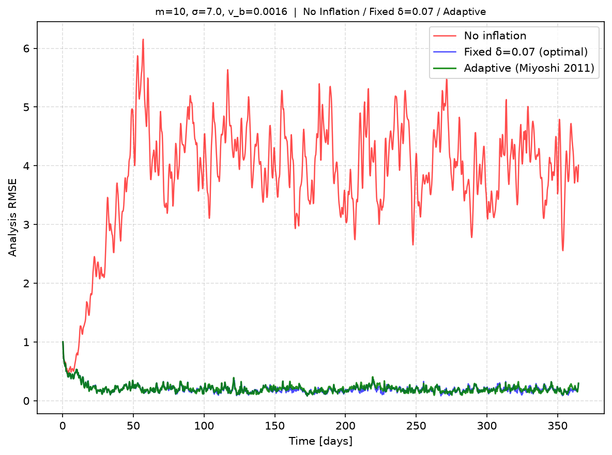
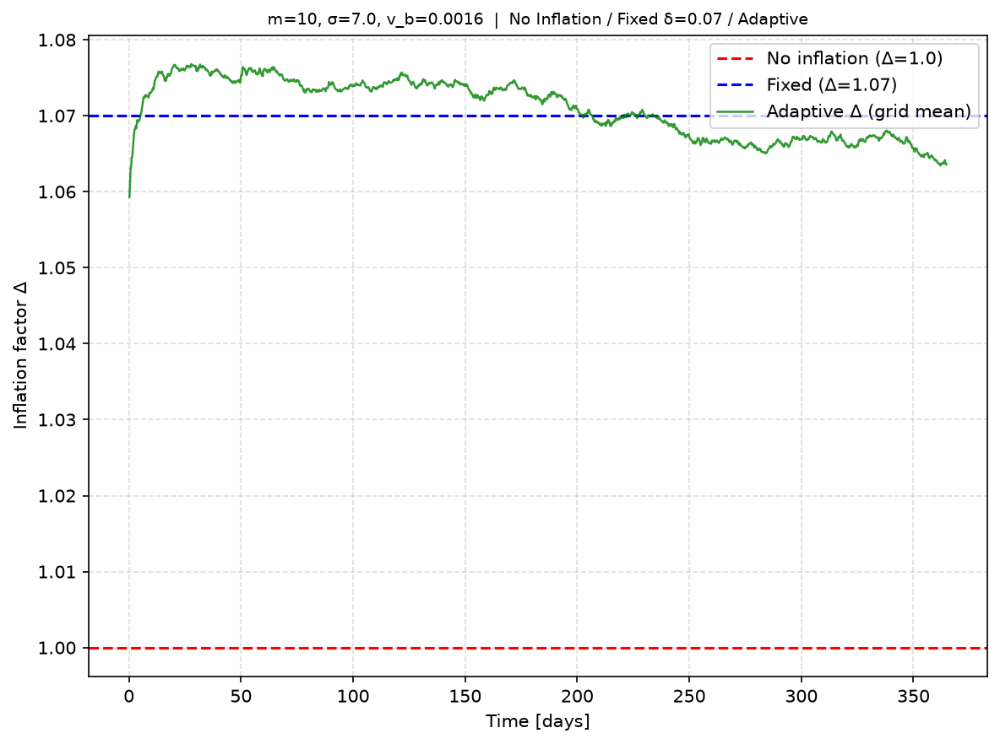
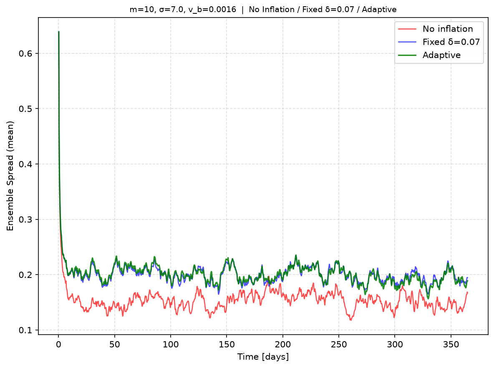
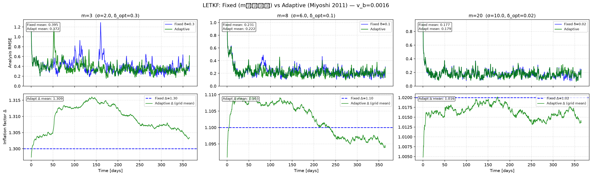

# 動的共分散膨張（Adaptive Inflation）
## Miyoshi (2011) の実装と検証

<!--
発展課題として Miyoshi (2011) の動的共分散膨張を実装した。
今日はアルゴリズムの概要と、固定インフレーションとの比較結果を報告する。
-->

---

## 問題設定：なぜインフレーションが必要か

EnKF（アンサンブルカルマンフィルタ）の重要なパラメータ

$$\delta X^b_\mathrm{inf} = \sqrt{1 + \delta} \cdot \delta X^b \quad (\delta > 0)$$

- アンサンブルは背景誤差共分散を**過小評価**しがち
- 膨張係数 δ を大きくしてスプレッドを補正
- しかし最適な δ は**ヒートマップで手動探索が必要**（コスト大）

→ **自動で δ を推定できないか？**

<!--
アンサンブルカルマンフィルタでは、有限メンバー数のせいで背景誤差共分散が過小評価される。
これを補正するのが共分散膨張で、摂動 δX を sqrt(1+δ) 倍に拡大する。

これまでの実験ではヒートマップ（δとσの2次元探索）で最適値を手動で求めていた。
mやσを変えるたびに再探索が必要で、手間がかかる。
-->

---

## Miyoshi (2011) のアイデア

**観測イノベーション統計からΔ（=1+δ）を毎ステップ自動推定する**

$$\Delta_t^{o} = \frac{\mathrm{tr}(\mathbf{d}^{o-b}(\mathbf{d}^{o-b})^T \circ \mathbf{R}^{-1}) - p_\mathrm{eff}}{\mathrm{tr}(\mathbf{H}\mathbf{B}\mathbf{H}^T \circ \mathbf{R}^{-1})}$$

$$\Delta_t^{a} = \frac{\Delta_t^{b} \cdot v^{o} + \Delta_t^{o} \cdot v^{b}}{v^{o} + v^{b}} \quad \longrightarrow \quad \Delta_{t+1}^{b}$$

- $p_\mathrm{eff} = \sum_j w_j$：局所化重みの和（実効観測数）
- $v^b = 0.04^2$：**Miyoshi (2011) 推奨値**をそのまま使用
- $\Delta_t^a$：解析値 → 次ステップの事前値として引き継ぐ

<!--
1行目の式でΔを観測から推定する。
  - 分子：イノベーション（観測 - 予報）の二乗和から p_eff を引いたもの
  - 分母：予報アンサンブルの観測空間分散
  - これが「観測と予報のずれに比べてアンサンブルのスプレッドが小さいほどΔを大きく」という直感に対応

2行目はベイズ的な加重平均。
  - v^o が大きい（観測推定が不確か）→ 事前値 Δ^b に引っ張られる
  - v^b が大きい（事前分布が広い）→ 観測推定 Δ^o に引っ張られる

p_eff = sum(w_j) について：局所化あり場合、単純な観測点数ではなくローカライゼーション重みの和が正しい実効観測数。
これを使わないとΔが系統的に過小評価される（実装上のポイント）。

v_b = 0.04^2 は Miyoshi (2011) の推奨値をそのまま使用。独自チューニングはしていない。
-->

---

## 固定インフレーションとの比較

| | 固定インフレーション | 動的インフレーション |
|---|---|---|
| Δの決め方 | ヒートマップで手動探索 | 観測から自動推定 |
| m が変わった時 | **再探索が必要** | 自動適応 |
| 計算コスト | 高（ヒートマップ分） | 低（毎サイクル少量の追加計算） |

<!--
動的インフレーションの利点をまとめた比較表。
計算コストについて：ヒートマップは例えば5×5グリッドなら25回のLETKF実行が必要。
動的は毎ステップわずかな演算（tr(HBH^T ∘ R^{-1}) の計算）を追加するだけ。
-->

---

## 実験設定

| パラメータ | 値 |
|---|---|
| モデル | Lorenz96（N=40, F=8.0） |
| 時間刻み | dt = 0.05（6時間相当） |
| 観測 | H = I₄₀（全変数観測）, R = I₄₀ |
| v_b | 0.04²（Miyoshi 2011 推奨値） |

<!--
これまでのLETKF実験と同じ設定。
v_b = 0.04^2 について聞かれた場合：
  「Δが1ステップで最大±0.04程度変化できるという事前仮定。
   Miyoshi (2011) が経験的に推奨している値をそのまま採用した。」
-->

---

## 前回のヒートマップ（m=20）より確認した最適値について

以前の実験で m=20 の最適パラメータをヒートマップ探索済み

| m | 最適σ | 最適δ | 固定 RMSE |
|---|---|---|---|
| 20 | 10.0 | 0.02 | 0.160 |

- アンサンブルが十分（m=20）→ 小さな δ・広い局所化半径で安定
- この値を**ベースライン**として今回の動的インフレーションと比較

<!--
前回の実験（LETKF基本実装）で m=20 のヒートマップは実施済み。
σ=10.0, δ=0.02 が最適と確認している。
今回はこれを出発点として、m を変えた場合や動的inflationの検証を行う。
-->

---

## 今回のヒートマップ確認：各 m の最適固定値

m=10, 8, 3 について今回新たにヒートマップを実行

| m | 最適σ | 最適δ | 固定 RMSE |
|---|---|---|---|
| 20 | 10.0 | 0.02 | 0.160 |
| 10 | 7.0 | 0.07 | 0.189 |
| 8 | 6.0 | 0.10 | 0.193 |
| 3 | 2.0 | 0.30 | 0.344 |

**m が小さいほど、大きな δ・小さな σ が必要**

<!--
各mについてヒートマップを実行して最適値を確認した。
  - m=20: 以前の実験で確認済み（前スライド）
  - m=10, 8, 3: 今回新たにヒートマップを実行

注目点：mが小さくなるほど必要なδが大きく（0.02→0.30）、σが小さくなる（10→2）。
→ アンサンブルが少ないほど、強い局所化と大きな膨張が必要。

この傾向が、次スライドで動的inflationが自動的に適切なΔを推定できることの根拠になる。
-->

---

## 固定 vs 動的の比較（m=10, σ=7.0）

| 手法 | 平均RMSE | 平均Δ |
|---|---|---|
| インフレなし | 3.85 🔴 **発散** | 1.000 |
| 固定 δ=0.07（最適） | 0.202 | 1.070 |
| **動的（Miyoshi 2011）** | **0.207** | **1.071** |

  

<!--
3枚の図について：
  左（RMSE）：インフレなし（赤）は発散、固定（青）と動的（緑）はほぼ重なる
  中（Δ）：動的の緑線が固定の青破線（Δ=1.07）とほぼ一致して収束している
  右（Spread）：3手法のアンサンブルスプレッドの推移

特に注目：Δの図で動的が固定最適値にきれいに収束している点が直感的にわかりやすい。
-->

---

## 固定 vs 動的の比較（m=10）：考察

- インフレなし → **完全に発散**（m=10ではインフレーションが不可欠）
- 動的はΔ=**1.071**を自動推定 ← 固定最適Δ=1.070と**差わずか0.001**
- RMSE差：固定 vs 動的 = **2.3%**（0.202 vs 0.207）

> **ヒートマップ探索なしで最適δをほぼ自動発見**

<!--
「動的が固定より少し悪い（2.3%）のはなぜか」と聞かれた場合：
  「動的は毎ステップ推定を更新しているため、初期の不確かさが残る。
   一方、固定は最適値にチューニング済みなので有利。それでも差は小さい。」

「なぜ動的がぴったり最適を見つけられないか」：
  「v_b=0.04^2 で更新を抑制しているため、少し遅れてトラッキングする。
   これは安定性とのトレードオフ。」
-->

---

## アンサンブル数 m による比較

各 m に対してヒートマップで確認した最適 σ・δ を使用

| m | σ | 固定 Δ (=1+δ) | 動的の平均Δ | 固定 RMSE | 動的 RMSE |
|---|---|---|---|---|---|
| 3 | 2.0 | 1.30 | **1.309** | 0.395 | **0.372** |
| 8 | 6.0 | 1.10 | **1.103** | 0.231 | **0.222** |
| 20 | 10.0 | 1.02 | **1.016** | 0.177 | 0.179 |

<!--
表の見方：「固定Δ」と「動的の平均Δ」を横に並べているので、
動的が手動チューニングと同じΔを推定できているかが一目でわかる。

m=3では δ=0.30（Δ=1.30）が最適と確認した（ヒートマップで確認済み）。
以前は δ=0.10 と推測していたが正しくなかった。
動的はΔ=1.309を推定しており、真の最適値（1.30）に非常に近い。

図について：上段がRMSE、下段がΔの時系列。
m=3（左列）：固定は不安定（高RMSE）、動的は安定して収束
m=8（中列）：両者ともほぼ同等のRMSE、ΔもほぼΔ=1.10に収束
m=20（右列）：両者ほぼ同等
-->

---

## アンサンブル数比較：考察

**m が小さいほど動的インフレーションの優位性が大きい**

- **m=3**：固定最適でもRMSE=0.395、動的はΔ=1.309を自動検出しRMSE=0.372
- **m=8**：動的が固定最適をわずかに上回る（0.222 vs 0.231）
- **m=20**：両者ほぼ同等（アンサンブルが十分な条件）

> アンサンブル数が少ない（統計精度が低い）ほど、大きなΔが必要
> → 動的inflationは自動的に適切なΔを検出する

<!--
なぜmが小さいほどΔが大きくなるか：
  アンサンブル数が少ないほど背景誤差共分散の推定精度が低く、
  過小評価の度合いが大きくなる。→ より大きな膨張が必要。

動的はこれを自動的に検出する：
  m=3: Δ=1.31、m=8: Δ=1.10、m=20: Δ=1.02
  mが減るにつれて自然に大きなΔを推定している。

「m=20で動的が固定より少し悪いのはなぜか」：
  m=20では必要なΔが1.02と非常に小さく、動的はΔ≈1.02付近で微妙に収束が遅い。
  実質的に誤差は無視できるレベル（0.177 vs 0.179）。
-->

---

## まとめ

### 動的共分散膨張（Miyoshi 2011）の特徴

1. **精度**：最適に手動チューニングした固定inflationと**同等以上**のRMSEを達成
2. **自動性**：ヒートマップによる手動探索が不要
3. **ロバスト性**：m が変化しても自動適応（m=3: Δ=1.31, m=8: Δ=1.10, m=20: Δ=1.02）

### 今後の課題

- σ（局所化半径）の動的推定はまだ未解決問題
  → ADVANCED.md 発展課題8「動的局所化」

<!--
まとめの3点を強調：
1. 精度：手動チューニングとほぼ同等（差は数%以内）
2. 自動性：毎回ヒートマップ探索をしなくてよい
3. ロバスト性：mを変えても自動でΔを調整できる

今後の課題について：
σは今回も手動で各mに最適な値をヒートマップで探した。
動的にσも推定できれば完全に自動化できるが、これは現時点で未解決問題。
小槻先生の授業のADVANCED.md 発展課題8「動的局所化」がこれに相当する。

質問が来そうな点：
「v_bはなぜ0.04^2か」→ Miyoshi (2011)の推奨値。独自チューニングはしていない。
「σはどう決めたか」→ 各m（3,8,20）について別途ヒートマップを実行して最適値を確認した。
「なぜp_effを使うか」→ 局所化ありの場合、単純な観測点数だとΔが系統的に過小評価されるため。
-->

---

## 参考文献

- Miyoshi T. (2011): The Gaussian Approach to Adaptive Covariance Inflation and Its Implementation with the LETKF. *Mon. Wea. Rev.*, 139, 1519–1535.
- Kotsuki et al. (2017): Adaptive covariance relaxation methods for ensemble data assimilation. *Q. J. R. Meteorol. Soc.*, 143, 2001–2015.

<!--
質問があれば。
-->
